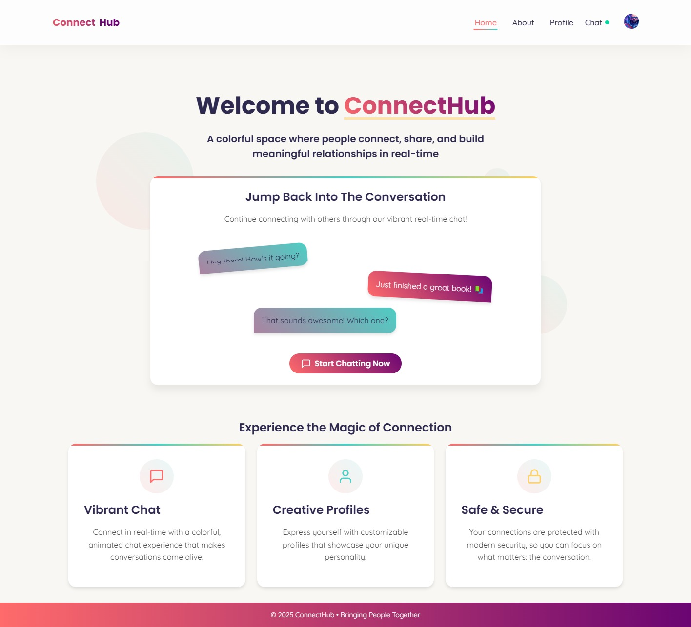
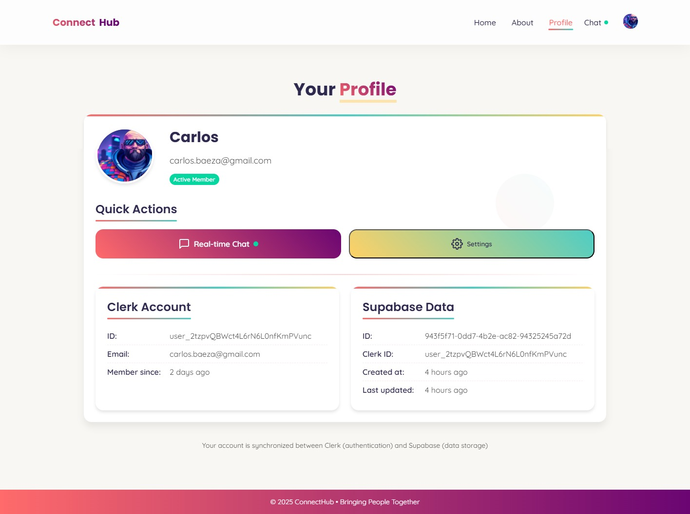
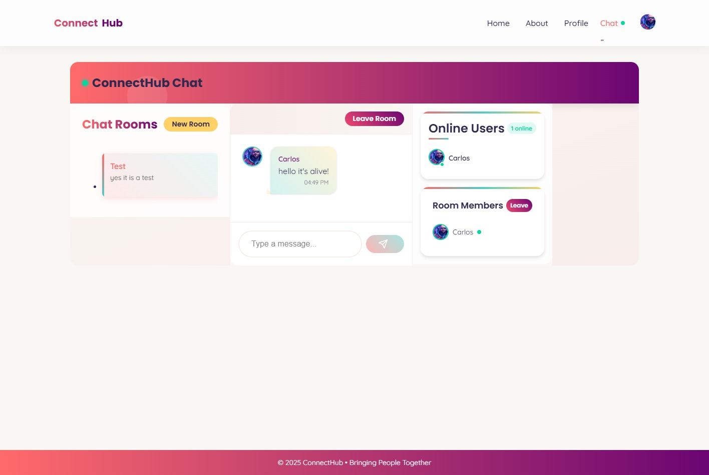

# ConnectHub - Real-time Chat Application with WebRTC

ConnectHub is a modern web application that combines Clerk authentication with Supabase for data persistence and WebRTC for real-time communication capabilities. This platform demonstrates how different technologies can be integrated to create a seamless real-time chat experience.

## Screenshots





*ConnectHub homepage showing the colorful chat interface with vibrant message bubbles and call-to-action buttons.*

> **Note:** To properly display this screenshot:
> 1. Save the screenshot image from this conversation
> 2. Rename it to `connecthub-screenshot.jpg`
> 3. Place it in the `public/` directory of the project

## Technology Stack

- **React (v19)**: Frontend library for building the user interface
- **Clerk**: Authentication provider for user sign-up, login, and identity management
- **Supabase**: Backend-as-a-Service providing:
  - PostgreSQL database for data persistence
  - Real-time subscriptions with websockets
  - Row-level security (RLS) for data protection
- **WebRTC**: Web Real-Time Communication for peer-to-peer video, voice, and data sharing
- **React Router (v7)**: Client-side routing for navigation between pages
- **Styled Components**: CSS-in-JS library for component styling
- **TailwindCSS**: Utility-first CSS framework for additional styling
- **ESLint & Husky**: Code quality and pre-commit hooks

### How the Technologies Work Together

1. **Authentication Flow**:
   - Users sign up and log in through Clerk's authentication system
   - After successful authentication, user data is synced to Supabase
   - The application uses Clerk for authentication while utilizing Supabase for data relationships

2. **Data & Real-time Communication**:
   - Supabase provides the database for storing user profiles, chat rooms, and messages
   - Supabase's real-time subscriptions are used for presence detection and message delivery
   - WebRTC enables direct peer-to-peer communication for enhanced real-time features

3. **Frontend Architecture**:
   - React components are organized by feature
   - Context API is used for state management
   - Custom hooks encapsulate business logic and real-time functionality

## System Architecture

```
├── public/                      # Static assets
├── src/                         # Source code
│   ├── config/                  # Application configuration
│   │   └── config.js            # Configuration settings
│   ├── features/                # Feature-based organization
│   │   ├── about/               # About page feature
│   │   │   └── AboutPage.js     # About page component
│   │   ├── auth/                # Authentication feature
│   │   │   ├── components/      # Auth components
│   │   │   │   └── ProtectedRoute.js # Route protection
│   │   │   ├── contexts/        # Auth context providers
│   │   │   │   ├── ClerkProvider.js   # Clerk auth provider
│   │   │   │   └── SupabaseUserProvider.js # Supabase user sync
│   │   │   ├── LoginPage.js     # Login page
│   │   │   ├── SignupPage.js    # Signup page
│   │   │   └── ProfilePage.js   # User profile page
│   │   ├── chat/                # Chat feature (core functionality)
│   │   │   ├── components/      # Chat UI components
│   │   │   │   ├── ChatRoom.js        # Main chat room component
│   │   │   │   ├── ChatInput.js       # Message input component
│   │   │   │   ├── ChatMessageItem.js # Individual message component
│   │   │   │   ├── ChatMessageList.js # Message list component
│   │   │   │   ├── ChatRoomList.js    # Room selection component
│   │   │   │   └── OnlineUsersList.js # Online users component
│   │   │   ├── contexts/        # Chat context providers
│   │   │   │   └── ChatProvider.js    # Chat state provider
│   │   │   ├── hooks/           # Chat custom hooks
│   │   │   │   ├── useChatRoom.js     # Room management hook
│   │   │   │   ├── useChatRooms.js    # Rooms list hook
│   │   │   │   └── useChatRealtime.js # Real-time hook (WebRTC)
│   │   │   ├── services/        # Chat backend services
│   │   │   │   └── chatService.js     # API service for chat
│   │   │   ├── utils/           # Utility functions
│   │   │   │   └── dateUtils.js       # Date formatting
│   │   │   └── ChatPage.js      # Main chat page
│   │   ├── common/              # Shared components
│   │   │   ├── components/      # Common UI components
│   │   │   └── theme/           # Theme definition
│   │   └── home/                # Home page feature
│   │       └── HomePage.js      # Home page component
│   ├── layouts/                 # Layout components
│   │   └── MainLayout.js        # Main application layout
│   ├── App.js                   # Application entry point
│   ├── index.js                 # React rendering setup
│   └── supabaseClient.js        # Supabase client configuration
├── supabase/                    # Supabase configuration
│   └── migrations/              # Database migrations
├── .env                         # Environment variables (gitignored)
├── .eslintrc.js                 # ESLint configuration
├── package.json                 # Dependencies and scripts
├── tailwind.config.js           # Tailwind CSS configuration
└── README.md                    # Project documentation
```

## File Descriptions

### Core Files

- **App.js**: Main application component that sets up routing and authentication providers
- **supabaseClient.js**: Configures Supabase clients for both regular and admin operations
- **features/auth/contexts/ClerkProvider.js**: Wraps Clerk authentication and provides user context
- **features/auth/contexts/SupabaseUserProvider.js**: Synchronizes Clerk users to Supabase

### Chat Feature

- **ChatPage.js**: Main container for the chat interface
- **ChatRoom.js**: Component for displaying a specific chat room with messages and user list
- **useChatRealtime.js**: Hook that manages real-time subscriptions for messages and presence
- **chatService.js**: Service containing functions for chat operations like sending messages and managing rooms

## Database Schema

The application uses a Supabase PostgreSQL database with the following schema:

### Users Table

```sql
CREATE TABLE public.users (
  id UUID PRIMARY KEY,
  clerk_id TEXT UNIQUE NOT NULL,
  email TEXT UNIQUE,
  first_name TEXT,
  last_name TEXT,
  full_name TEXT,
  image_url TEXT,
  created_at TIMESTAMPTZ NOT NULL DEFAULT now(),
  updated_at TIMESTAMPTZ NOT NULL DEFAULT now()
);
```

### Chat Rooms Table

```sql
CREATE TABLE public.chat_rooms (
  id UUID PRIMARY KEY DEFAULT uuid_generate_v4(),
  name TEXT NOT NULL,
  description TEXT,
  is_private BOOLEAN DEFAULT false,
  created_by UUID REFERENCES public.users(id),
  created_at TIMESTAMPTZ NOT NULL DEFAULT now(),
  updated_at TIMESTAMPTZ NOT NULL DEFAULT now()
);
```

### Chat Room Members Table

```sql
CREATE TABLE public.chat_room_members (
  id UUID PRIMARY KEY DEFAULT uuid_generate_v4(),
  room_id UUID REFERENCES public.chat_rooms(id) ON DELETE CASCADE,
  user_id UUID REFERENCES public.users(id) ON DELETE CASCADE,
  joined_at TIMESTAMPTZ NOT NULL DEFAULT now(),
  UNIQUE(room_id, user_id)
);
```

### Chat Messages Table

```sql
CREATE TABLE public.chat_messages (
  id UUID PRIMARY KEY DEFAULT uuid_generate_v4(),
  room_id UUID REFERENCES public.chat_rooms(id) ON DELETE CASCADE,
  user_id UUID REFERENCES public.users(id) ON DELETE SET NULL,
  message TEXT NOT NULL,
  created_at TIMESTAMPTZ NOT NULL DEFAULT now()
);
```

### User Presence Table

```sql
CREATE TABLE public.user_presence (
  id UUID PRIMARY KEY REFERENCES public.users(id) ON DELETE CASCADE,
  last_seen TIMESTAMPTZ NOT NULL DEFAULT now(),
  status TEXT DEFAULT 'online'
);
```

## Development Journey

The development of ConnectHub followed these key phases:

1. **Authentication Architecture**: 
   - Implemented Clerk for authentication
   - Created synchronization system with Supabase for user data persistence
   - Developed protected routes for authenticated content

2. **Database Design**: 
   - Designed and implemented the database schema in Supabase
   - Set up Row Level Security (RLS) policies to protect user data
   - Created database functions and triggers for advanced operations

3. **Real-time Chat System**:
   - Built chat room creation and management features
   - Implemented real-time message delivery using Supabase subscriptions
   - Created presence detection system to track online users

4. **WebRTC Integration**:
   - Integrated WebRTC for peer-to-peer communication
   - Implemented real-time user presence with WebRTC data channels
   - Built UI components for displaying online status and activities

5. **UI/UX Design**:
   - Developed responsive layout with Styled Components and TailwindCSS
   - Created animated transitions for improved user experience
   - Implemented modern UI elements like message bubbles and user avatars

6. **Testing and Optimization**:
   - Performed cross-browser testing for WebRTC compatibility
   - Optimized real-time subscription performance
   - Added error handling and fallback mechanisms

## Getting Started

### Prerequisites

- Node.js (v16 or higher)
- Clerk account and API keys
- Supabase account and API keys

### Installation

1. Clone the repository
2. Install dependencies:

```bash
npm install
```

3. Create a `.env` file with the following variables:

```
# Clerk API keys
REACT_APP_CLERK_PUBLISHABLE_KEY=your_clerk_publishable_key
REACT_APP_CLERK_SECRET_KEY=your_clerk_secret_key

# Supabase configuration
REACT_APP_SUPABASE_URL=your_supabase_url
REACT_APP_SUPABASE_ANON_KEY=your_supabase_anon_key
REACT_APP_SUPABASE_SERVICE_KEY=your_supabase_service_key
```

4. Start the development server:

```bash
npm start
```

## License

This project is licensed under the MIT License.
